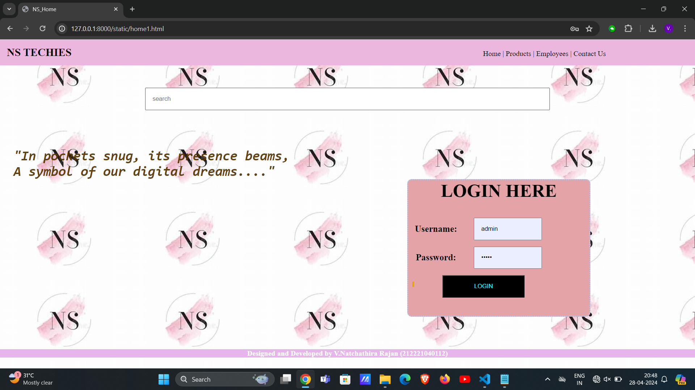
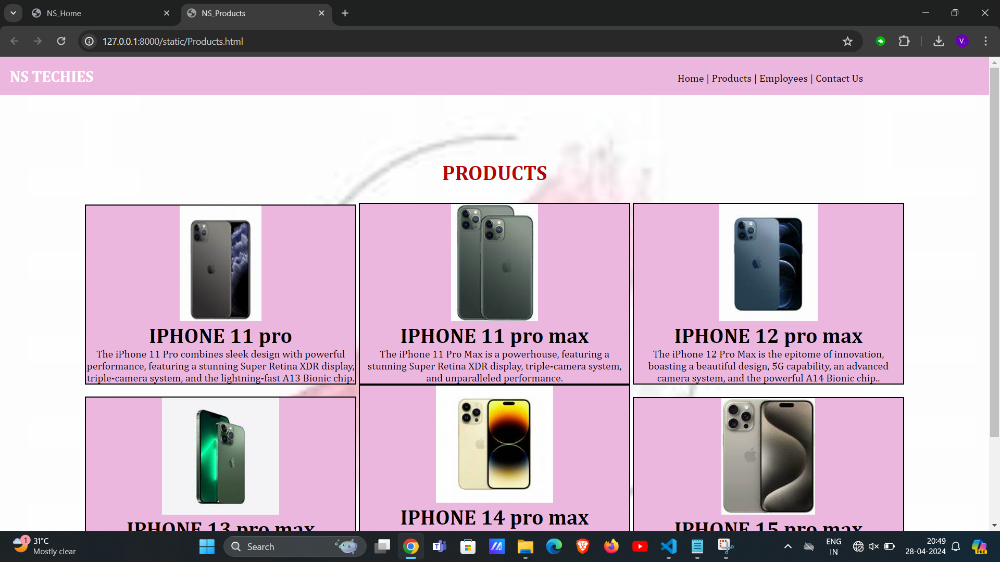
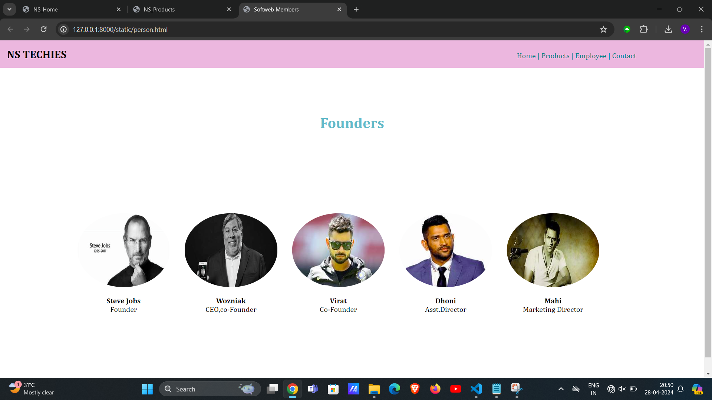
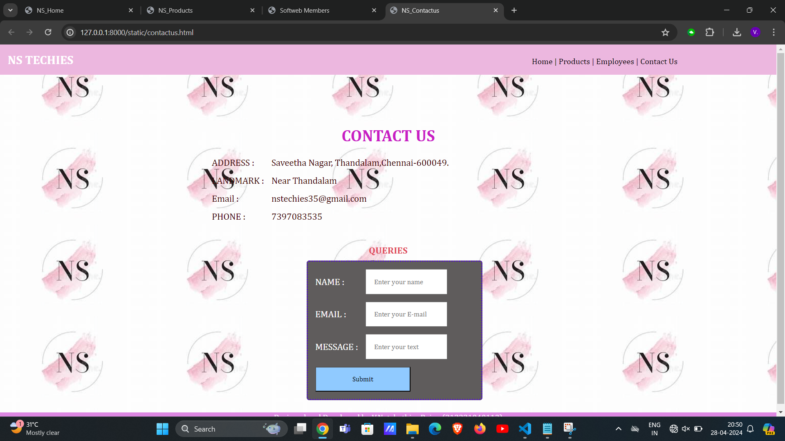

# Ex.07 Software Product Company Website
## Date:28-4-24

## AIM:
To develop a static company website to display the softwares and services provided by the company.

## DESIGN STEPS:

### Step 1:
Requirement collection.

### Step 2:
Creating the layout using HTML and CSS.

### Step 3:
Updating the sample content.

### Step 4:
Choose the appropriate style and color scheme.

### Step 5:
Validate the layout in various browsers.

### Step 6:
Validate the HTML code.

### Step 7:
Publish the website in the given URL.

## PROGRAM:
```
home1.html
<!DOCTYPE html>
<html lang="en">
<head>
    <meta charset="UTF-8">
    <meta name="viewport" content="width=device-width, initial-scale=1.0">
    <title>NS_Home</title>
    <style>
        *{
            margin:0;
            padding:0
        }
        #nav{
            background-color:rgb(231, 190, 222);
            color:rgb(8, 7, 7);
            padding: 15px;
    
        }
        li,h1,ul{
            display:inline;
        }
        ul{
            margin-left:60%;
        }
        a{
            color:black;
            text-decoration: none;
        }
        a:hover{
            color:rgb(128, 31, 31);
            cursor:pointer;
        }
        input{
            width: 60%;
            padding: 15px;  
        }
            .searchbar{
            padding:50px;
            text-align: center;
        }
        
        .box {
            display:inline-block;
            border-style:dotted ;
            border-radius: 10px;
            border-color: rgb(171, 204, 227);
            width: 400px;
            min-height: 300px;
            font-size: 20px;
            background-color:rgb(226, 168, 174);
        
        }
        .heading1{
            color:black;
            text-align: center;
            padding-top: 20px;
        }
        .heading2{
            color:rgba(85, 51, 18, 0.925);
            text-align: justify;
            font-size: 30px;
            margin-left: 30px;
        }
        .edge{
            padding-left: 900px;
        }
        .box{
            text-align: center;
        }
        .bottomdiv{
            background-color:rgb(222, 189, 232);
            color:white;
            text-align: center;
            position:relative;
            display:block;
            margin-top: 72px;

        }
        table{
            margin-center: 400px;
        }
    </style>
</head>
<body style="background-image: url('ns1.jpeg');>
    

    <div class="header">
        <nav id="nav">
            <h1>
                NS TECHIES
            </h1>
                <ul>
                    <li class="li1"> 
                        <a href="home1.html" target="_blank">Home  |</a>
                    </li>
                    <li class="li2"> 
                        <a href="Products.html" target="_blank">Products  |</a>
                    </li>
                    <li class="li4"> 
                        <a href="person.html" target="_blank">Employees  |</a>
                    </li>
                    <li class="li5"> 
                        <a href="contactus.html" target="_blank">Contact Us</a>
                    </li>
                </ul>
        </nav>
    </div>
    <div class="searchbar">
    <input placeholder="search">
    </div>
        <div><pre class="heading2"><i><b>
"In pockets snug, its presence beams,
A symbol of our digital dreams...."<b></i></pre></div>
        <div class="edge">
            <div class="box">
            <h1 class="heading1">LOGIN HERE</h1>
            <br>
            <br>
            <form>
                <table cellpadding="15px" cellspacing="15px">
                    <tr>
                        <td>
                            Username:
                        </td>
                        <td>
                            <input type="email" name="name" placeholder="Enter a Email">
                        </td>
                    </tr>
                    <tr>
                        <td>
                            Password:
                        </td>
                        <td>
                            <input type="password" name="pwd" placeholder="Enter a Password">
                        </td>
                    </tr>
                    <tr>
                        <td colspan="2">
                            <input type="submit" value="LOGIN" style="background-color: black; color:aqua;">
                        </td>
                    </tr>
                </table>
                
            </form>
            </div>
        </div>
    <div class="bottomdiv">
        <p>Designed and Developed by V.Natchathira Rajan (212221040112)</p>
    </div>
</body>
<html>
```
```
product.html
<!DOCTYPE html>
<html lang="en">
<head>
    <meta charset="UTF-8">
    <meta name="viewport" content="width=device-width, initial-scale=1.0">
    <title>NS_Products</title>
    <style>
        *{
            margin:0;
            padding:0;
            font-family:Cambria, Cochin, Georgia, Times, 'Times New Roman', serif;
        }
        #nav{
            background-color:rgb(231, 190, 222);
            color:white;
            padding: 15px;
    
        }
        li,.heading1,ul{
            display:inline;
        }
        ul{
            margin-left:60%
        }
        li{
            color:black;
        }
        li:hover{
            color:white;
            cursor:pointer;
        }
        input{
            width: 60%;
            padding: 15px;
        }
            .searchbar{
            padding:50px;
            text-align: center;
        }
        .box{
            border-color:black;
            border-width:2px;
            border-style:solid;
            display: inline-block;
            width: 414px;
        }
        .product{

            text-align: center;
        }
        .box{
            background-color:rgb(231, 190, 222);
            cursor:pointer;
        }
        a{
            color:black;
            text-decoration: none;
        }
        a:hover{
            color:white;
            cursor:pointer;
        }
        .heading2{
            padding-top: 100px;
            padding-bottom: 10px;
            text-align: center;
            color:rgb(180, 40, 40);
        }
        .bottomdiv{
            background-color:rgb(175, 118, 177);
            color:white;
            text-align: center;
            position:relative;
            display:block;
            margin-top: 56px;

        }
    </style>
</head>
<body style="background-image: url('ns1.jpeg'); background-size: cover;">

        <nav id="nav">
            <h1 class="heading1">NS TECHIES</h1>
                <ul>
                    <li class="li1"> 
                        <a href="home1.html" target="_blank">Home  |</a>
                    </li>
                    <li class="li2"> 
                        <a href="Products.html" target="_blank">Products  |</a>
                    </li>
                    <li class="li4"> 
                        <a href="person.html" target="_blank">Employees  |</a>
                    </li>
                    <li class="li5"> 
                        <a href="contactus.html" target="_blank">Contact Us</a>
                    </li>
                </ul>
            </nav>
        </div>
        <h1 class="heading2">PRODUCTS</h1>
        <br>
        <div class="product">
            <div class="box">
                
                <h1>IPHONE 11 pro</h1>
                <p>The iPhone 11 Pro combines sleek design with powerful performance, featuring a stunning Super Retina XDR display, triple-camera system, and the lightning-fast A13 Bionic chip.</p>
            </div>
            <div class="box">
                
                <h1>IPHONE 11 pro max</h1>
                <p>The iPhone 11 Pro Max is a powerhouse, featuring a stunning Super Retina XDR display, triple-camera system, and unparalleled performance.</p>
            </div>
           
            <div class="box">
                
                <h1>IPHONE 12 pro max</h1>
                <p>The iPhone 12 Pro Max is the epitome of innovation, boasting a beautiful design, 5G capability, an advanced camera system, and the powerful A14 Bionic chip..</p>
            </div>
            
            <div class="box">
                
                <h1>IPHONE 13 pro max</h1>
                <p>The iPhone 13 Pro Max takes excellence to new heights with its ProMotion display, enhanced camera capabilities, longer battery life, and lightning-fast performance powered by the A15 Bionic chip.</p>
            </div>
            
            <div class="box">
                
                <h1>IPHONE 14 pro max</h1>
                <p>The iPhone 14 Pro Max sets new standards with its cutting-edge technology, including a refined design, improved camera system, faster processing with the A16 Bionic chip, and a host of innovative features that elevate your smartphone experience.</p>
            </div>
            <div class="box">
                
                <h1>IPHONE 15 pro max</h1>
                <p>The iPhone 15 Pro Max is the latest flagship from Apple, featuring cutting-edge technology, advanced camera capabilities, blazing-fast performance, and a stunning design.</p>
            </div>
        </div>
    </div>
    <div class="bottomdiv">
        <p>Designed and Developed by V.Natchathira Rajan (212221040112)</p>
    </div>
</body>
</html>
```
person.html


<!DOCTYPE html>
<html lang="en">
<head>
    <meta charset="UTF-8">
    <meta name="viewport" content="width=device-width, initial-scale=1.0">
    <title>Softweb Members</title>
    <style>
        *{
            margin:0;
            padding:0;
            font-family:Cambria, Cochin, Georgia, Times, 'Times New Roman', serif;
        }
        #nav{
            background-color:rgb(231, 190, 222);
            color:#000000;
            padding: 15px;
    
        }
        li,.heading1,ul{
            display:inline;
        }
        ul{
            margin-left:65%
        }
        li{
            color:lightblue;
        }
        li:hover{
            color:#fafafa;
            cursor:pointer;
        }
        input{
            width: 60%;
            padding: 15px;
        }
        a{
            color:teal;
text-decoration: none;
        }
        a:hover{
            color:#ffffff;
            cursor:pointer;
        }
        .heading2{
            padding-top: 100px;
            padding-bottom: 10px;
            text-align: center;
            color:#63b8c0;
        }
        .bottomdiv{
            background-color:aqua;
            color:black;
            text-align: center;
            position:relative;
            display:block;
            margin-top: 0.7px;

        }
        img{
            border-radius: 50%;
            width: 200px;
            display: inline;
            padding:15px;
            
        }
        .person{
            margin: 150px;
            text-align: center;
        }
        b,p{
            color:black;
            text-align: center;
        }
      
</style>
</head>
<body>
    <div class="header">
        <nav id="nav">
            <h1 class="heading1">NS TECHIES</h1>
                <ul>
                    <li class="li1"> 
                        <a href="home1.html" target="_blank">Home  |</a>
                    </li>
                    <li class="li2"> 
                        <a href="products.html" target="_blank">Products  |</a>
                    </li>
                    <li class="li4"> 
                        <a href="person.html" target="_blank">Employee |</a>
                    </li>
                    <li class="li5"> 
                        <a href="contactus.html" target="_blank">Contact</a>
                    </li>
                </ul>
            </nav>
        </div>
        <h1 class="heading2">Founders</h1>
        <table class="person">
            <tr>
                <td>
                    
                </td>
		

                <td>
                    
                </td>
		
                <td>
                   
                </td>
                <td>
                    
                </td>
                <td>
                    
                </td>
            </tr>
            <tr>
                <td>
                    <b>Steve Jobs</b>
                    <p>Founder</p>
                </td>
                <td>
                    <b>Wozniak</b>
                    <p>CEO,co-Founder</p>
                </td>
                <td>
                    <b>Virat</b>
                    <p>Co-Founder</p>
                </td>
                <td>
                    <b>Dhoni</b>
                    <p>Asst.Director</p>
                </td>
                <td>
                    <b>Mahi</b>
                    <p>Marketing Director</p>
                </td>
              
            </tr>
        </table>
    </div>
    <div class="bottomdiv">
        <p>Designed and Developed by V.Natchathira Rajan (212221040112)</p>
    </div>
</body>
</html>
```
```
contactus.html
<!DOCTYPE html>
<html lang="en">
<head>
    <meta charset="UTF-8">
    <meta name="viewport" content="width=device-width, initial-scale=1.0">
    <title>NS_Contactus</title>
    <style>
        *{
            margin:0;
            padding:0;
            font-family:Cambria, Cochin, Georgia, Times, 'Times New Roman', serif;
        }
        #nav{
            background-color:rgb(231, 190, 222);
            color:white;
            padding: 15px;
    
        }
        li,.heading1,ul{
            display:inline;
        }
        ul{
            margin-left:60%
        }
        li{
            color:black;
        }
        li:hover{
            color:white;
            cursor:pointer;
        }
        input{
            width: 60%;
            padding: 15px;
        }
            .searchbar{
            padding:50px;
            text-align: center;
        }
        .box{
            border-color:black;
            border-width:2px;
            border-style:solid;
            display: inline-block;
            width: 414px;
        }
        .product{

            text-align: center;
        }
        .box{
            background-color:teal;
            cursor:pointer;
        }
        a{
            color:black;
            text-decoration: none;
        }
        a:hover{
            color:rgb(149, 28, 28);
            cursor:pointer;
        }
        .heading2{
            padding-top: 100px;
            padding-bottom: 10px;
            text-align: center;
            color: rgb(188, 84, 190);
        }
        .table1{
            color:rgb(66, 3, 3);
            font-size: large;
        }
        .contactus{
            margin-left:400px;
        }
        .heading3{
            padding-top: 30px;
            padding-bottom: 10px;
            text-align: center;
            color: rgb(219, 89, 113);
        }
        .table2{
            color:white;
            font-size: large;
            background-color:rgb(95, 92, 92);
            border-radius: 5px;
            border-style:dotted;
            border-color: rgb(41, 71, 190);

        }
        .queries{
            margin-left:600px;
        }
        .bottomdiv{
            background-color:rgb(211, 152, 221);
            color:white;
            text-align: center;
            position:relative;
            display:block;
            margin-top: 24px;

        }
    </style>
</head>
<body style="background-image: url('ns1.jpeg');>

    
    
    <div class="header">
        <nav id="nav">
            <h1 class="heading1">NS TECHIES</h1>
                <ul>
                    <li class="li1"> 
                        <a href="home1.html" target="_blank">Home  |</a>
                    </li>
                    <li class="li2"> 
                        <a href="Products.html" target="_blank">Products  |</a>
                    </li>
                    <li class="li4"> 
                        <a href="person.html" target="_blank">Employees  |</a>
                    </li>
                    <li class="li5"> 
                        <a href="contactus.html" target="_blank">Contact Us</a>
                    </li>
                </ul>
            </nav>
        </div>
        <h1 class="heading2">CONTACT US</h1>
        <div class="contactus">
            <table cellpadding="15px" cellspacing="15px" class="table1">
                <tr>
                    <td>
                        ADDRESS :
                    </td>
                    <td>
                        Saveetha Nagar, Thandalam,Chennai-600049. 
                    </td>
                </tr>
                <tr>
                    <td>
                        LANDMARK :
                    </td>
                    <td>
                      Near Thandalam
                    </td>
                </tr>
                <tr>
                    <td>
                        Email :
                    </td>
                    <td>
                        nstechies35@gmail.com
                    </td>
                </tr>
                <tr>
                    <td>
                        PHONE :
                    </td>
                    <td>
                        7397083535
                    </td>
                </tr>
            </table>
        </div>
        <div>
            <h3 class="heading3">QUERIES</h3>
            <div class="queries">
                <table cellpadding="15px" cellspacing="15px" class="table2">
                    <tr>
                        <td>
                            NAME :
                        </td>
                        <td>
                            <input type="name" placeholder="Enter your name"> 
                        </td>
                    </tr>
                    <tr>
                        <td>
                            EMAIL :
                        </td>
                        <td>
                            <input type="email" placeholder="Enter your E-mail">
                        </td>
                    </tr>
                    <tr>
                        <td>
                            MESSAGE :
                        </td>
                        <td>
                            <input type="text" placeholder="Enter your text">
                        </td>
                    </tr>
                    <tr>
                        <td colspan="2">
                            <input type="submit" style="background-color: lightskyblue; color: black;">
                        </td>
                    </tr>
            </table>
        </div>
        <div class="bottomdiv">
            <p>Designed and Developed by V.Natchathira Rajan (212221040112)</p>
        </div>
    </div>
</body>
</html>

```


## OUTPUT:




## RESULT:
The program for designing software company website using HTML and CSS is completed successfully.
